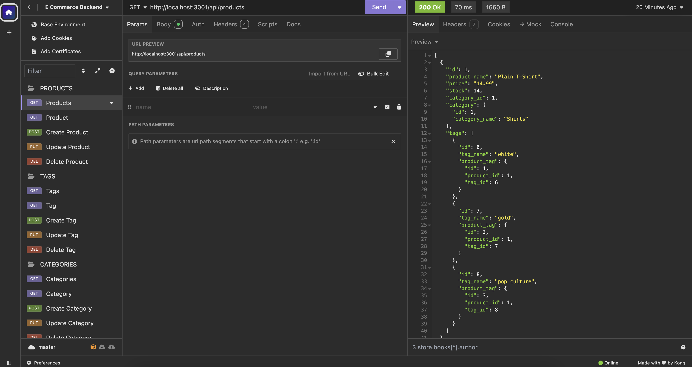

# E-Commerce-Back-End

  ## Description

  Implemented the back end api for an E-Commerce site. Configured a working Express.js API using Sequelize to interact with a PostgreSQL database.
  
  
 
  ## Installation
  Clone repo and run `npm install`.

  ## Usage
  To run the application, execute the command `npm start`.

  ## Deployed Application URL
  [Walkthrough Video](./assets/E_Commerce_Backend_1.mov)

  
  [Walkthrough Video YouTube Link](https://youtu.be/oaUior-1RFM)

  ## Screenshot
  

  ## Features
  You have the ability to create, update, and delete categories, products and tags.

  ## License
    Licensed under the MIT license.